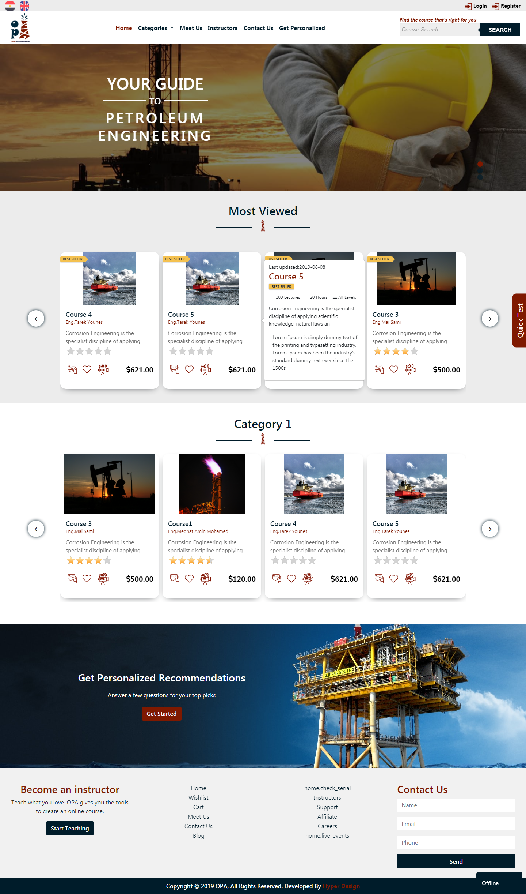

# OPA

OPA is a powerful online platform for petroleum courses. Every course on OPA is instructed by top engineers in the oil and gas industry. OPA Is More Than Just An Academy. It’s Also a Community Of Like-Minded, Creative People, Looking To Make The learning better Better.

Live Website preview
-----------
* (http://opacourses.com/opa/) 

 Key features: 
-----------

* Responsive website
* Using framework Bootstrap
* Using JQuery Plugins 

Screenshot
-----------

  

About me
-----------
 You can follow me at:
1. [Linkedin](https://www.linkedin.com/in/ahmed-alhoseny/)
2. [Behance](https://www.behance.net/ahmed-alhosany)
3. [Facebook](https://www.facebook.com/mido.hisham.777)

  

